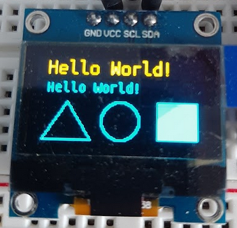

# ESP-SSD-1306

Component for ESP-IDF for controlling small OLED displays with an ESP32 over i2c.  First a canvas grid is drawn on, then the grid is converted to the order that SSD-1306 displays expect.

## Adding Component to a Project

Add this as a submodule or put it in a neighbouring path and point CMakeLists.txt via `COMPONENT_DIRS`.  

OR

Copy the `components/ssd-1306-i2c` directory to your project's components directory.

Add `ssd-1306-i2c` to `REQUIRES` in the CMakeLists.txt for you project.

## Usage

See **examples/oled-draw-test/** for an example on how to use the component.

## Fonts

`font/fontexport.py` is a module for GIMP that renders characters and saves integers representing the fonts to a header and c file.

A 12 pt and 16 pt font are included in the component, but feel free to use the script to generate your own.  See the script for more information.

Right now I'm only supporting single byte characters but I plan to include support for all UTF-8 at some point.
