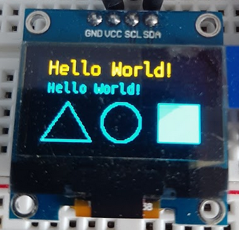

# OLED Draw Test

Basic example using the `ssd-1306-i2c` component to draw text and shapes to an OLED screen.

## Setup

Install ESP-IDF using their guide, build with typical `idf.py` commands.

Some values can be changed via `idf.py menuconfig` under Components -> SSD 1306 LCD Screen.